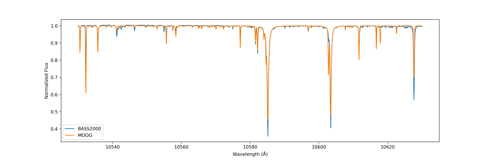

# pymoog

> We present you a black-box.

`pymoog` is a python3 wrapper for running the LTE spectrum synthesis part of the code [MOOG](https://www.as.utexas.edu/~chris/moog.html) by Chris Sneden.
The synthetic spectra from optical to near infrared region of the model stars in Kurucz model ATLAS can be generated by `pymoog` in a few commands.
This package can be run in Linux or Mac system.

*Part of the infrared observed (from [BASS2000](http://bass2000.obspm.fr/solar_spect.php)) and synthetic solar spectra by MOOG*

There is also [a stand-alone version](https://github.com/MingjieJian/moog_nosm) of the MOOG used here.

## Installation

- `clone` this repository and `cd` into the corresponding folder;
- `pip install .`
- `pip install -r requirements.txt`

## Tutorial

Once you are done with the installation, you can use the `pymoog` package now on your code!
Please refer to [this notebook](docs/Tutorial.ipynb) for a tutorial on how to use the package.
