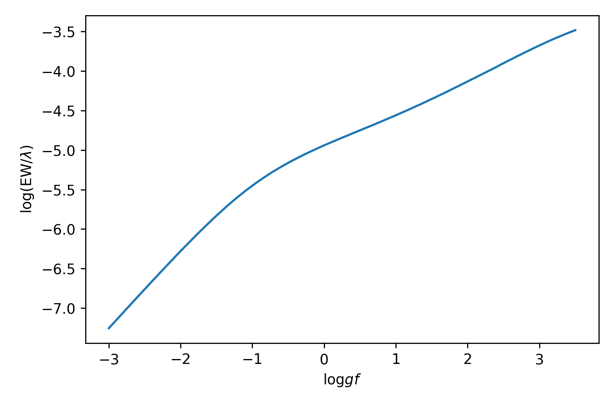

# cog

## Example

Let’s look at a Si line with following parameters (and stored in file `use.list`):

```
wavelength	id	EP	loggf	C6	D0	EW
0	11040.405	14.0	6.2061	-1.449	-7.32	NaN	22.53
```

```py
c = pymoog.cog.cog(5000, 4.0, 0, line_list=MOOG_run_path+'use.list')
c.prepare_file()
c.run_moog()
c.read_output()
```


