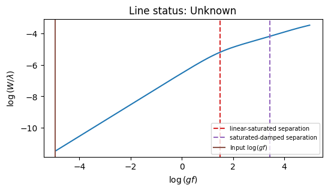

# cog: curve-of-growth creation for individual line

The `cog` driver generate the curve-of-growth for individual line.

Let’s look at a Si line with following parameters (and stored in file `use.list`):

```
     wavelength    id     EP  loggf    C6  D0  EW
1001    9122.791  20.0  6.001 -4.956 -6.55 NaN NaN
```

This line can be loaded by:

```py
vald = pymoog.line_data.read_linelist('vald_winered')
use_list = vald.loc[1001:1001]
```

```py
c = pymoog.cog.cog(5000, 4, 0, line_list=use_list)
c.prepare_file()
c.run_moog()
c.read_output()
```

The result is sotred in `c.loggf` and `c.logrw`.


