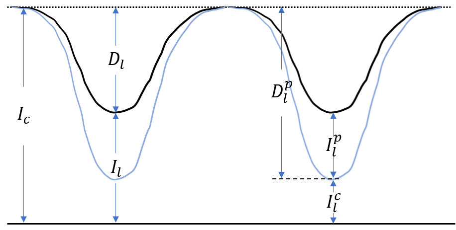

# Contribution function

Contribution function describes where the line forms.

From radiative transfer, we have the formal solution of intensity:

$I_\nu(0) = \int_0^{\infty} S_\nu e^{-\frac{\tau_\nu}{\mu}} \frac{d\tau_\nu}{\mu}$

The expression inside the intergral, $C_I = \frac{1}{\mu} S_\nu e^{-\frac{\tau_\nu}{\mu}}$, describe the amount of intensity emitted in a specific layer $\Delta \tau_\nu$, when the atmosphere is divided into some plane parallels.
We call $C_I$ as the contribution function of intensity 

However, we usually care more about where the absorption (remove of intensity) is formed instead of intensity, so we need to write the contribution function of the depression in the line core.
We divide the intensity and depression of a line into following parts:

Here the black curve represents the actual spectral line, and the light blue curve represents the spectral line when no line emission presents.

- $I_c$ is the emission of continuum and represents the intensity when the spectral line is absent;
- $D_l^p$ is the depression of $I_c$ due to line absorption;
- $I_l^c$ is the emission of continuum not absorbed by spectral line;
- $I_l^p$ is the emission of spectral line;
- $D_l = D_l^p - I_l^p$ is the amount of observed absorption; 
- $I_l = I_l^c + I_l^p$ is the amount of observed intensity.

Then we can derive their expression and contribution as follow ($\eta = \kappa_l / \kappa_c$):

||expression|contribution function|
|:--:|:--:|:--:|
|$I_c$|$\int_0^{\infty} S_\nu e^{-\frac{\tau_\nu}{\mu}} \frac{d\tau_\nu}{\mu}$|$S_\nu e^{-\frac{\tau_\nu}{\mu}}$|
|$D_l^p$|$\int_0^\infty \left[ \int_{\tau_c}^\infty S_c(\tau_c) e^{-\tau_c} d\tau_c \right] e^{-\tau_l} \eta d\tau_c$|$\left[ \int_{\tau_c}^\infty S_c(\tau_c) e^{-\tau_c} d\tau_c \right] e^{-\tau_l} \eta$|
|$I_l^p$|$\int_0^\infty S_l e^{-(\tau_c+\tau_l)} \eta d\tau_c$|$S_l e^{-(\tau_c+\tau_l)} \eta$|
|$D_l$|$\int_0^\infty \left[ \int_{\tau_c}^\infty S_c(\tau_c) e^{-\tau_c} d\tau_c - S_l(\tau_c) e^{-\tau_c} \right] e^{-\tau_l} \eta d\tau_c$|$\left[ \int_{\tau_c}^\infty S_c(\tau_c) e^{-\tau_c} d\tau_c - S_l(\tau_c) e^{-\tau_c} \right] e^{-\tau_l} \eta$|
|$I_l^c$|$\int_0^\infty S_c e^{-(\tau_c+\tau_l)} d\tau_c$|$S_c e^{-(\tau_c+\tau_l)}$|
|$I_l$|$\int_0^\infty (S_c + \eta S_l) e^{-(\tau_c+\tau_l)} d\tau_c$|$(S_c + \eta S_l) e^{-(\tau_c+\tau_l)}$|

As an example, the following figure shows the three ocntribution function calculated by pymoog:

