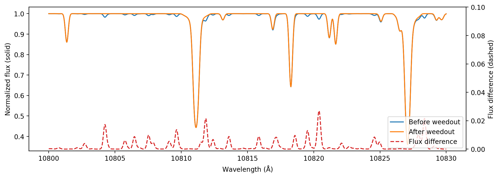

# weedout

Segregation of very weak lines from stronger ones in a large line list.

## Example

```py
w = pymoog.weedout.weedout(5000, 4.0, 0, 10830-15, 10830+15, kappa_ratio=0.2, line_list='vald_3000_11000',)
w.prepare_file()
w.run_moog()
w.compare(50000)
plt.plot(w.wav_all, w.flux_all, label='before weedout')
plt.plot(w.wav_keep, w.flux_keep, label='after weedout')
```


