# Model grid points

## Kurucz model

- The metallicity is from -5 to 1.0 with a step of 0.5, except in -0.3, -0.2, -0.1, 0, 0.1, 0.2, 0.3.
- logg grid is from 0 to 5 with a step of 0.5.
- Teff grid is from 3500 to 50000 with a step of 250, 500, 1000 or 2500.

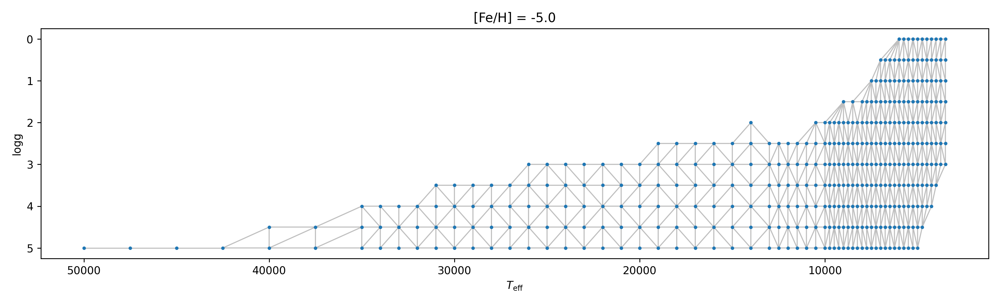
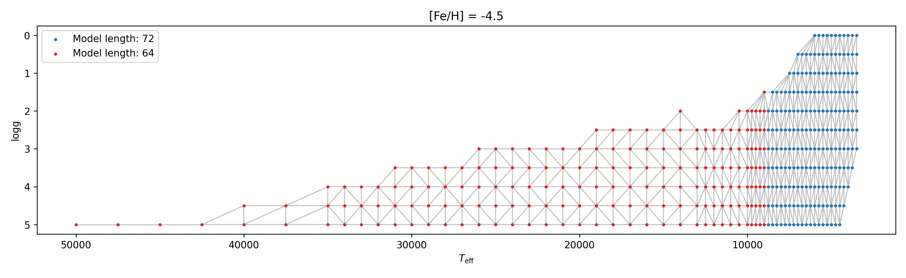

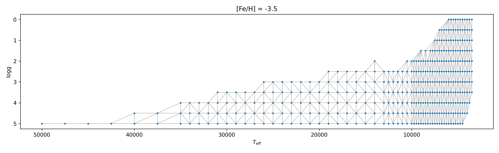
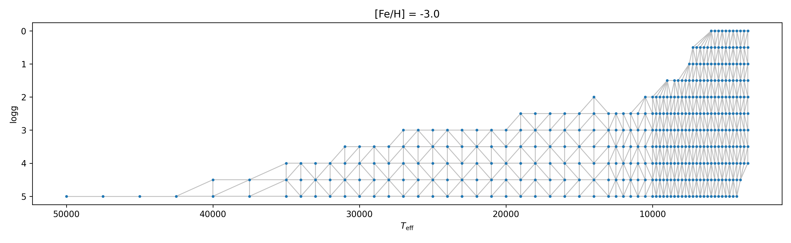
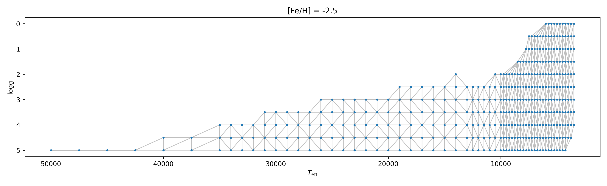
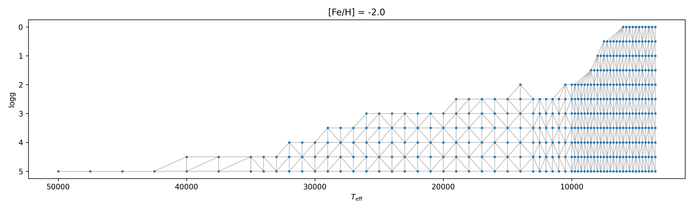
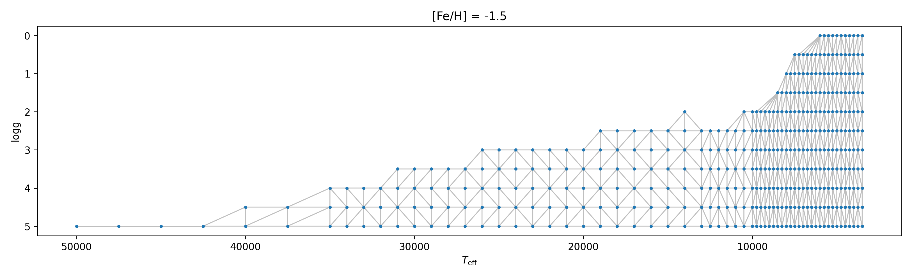
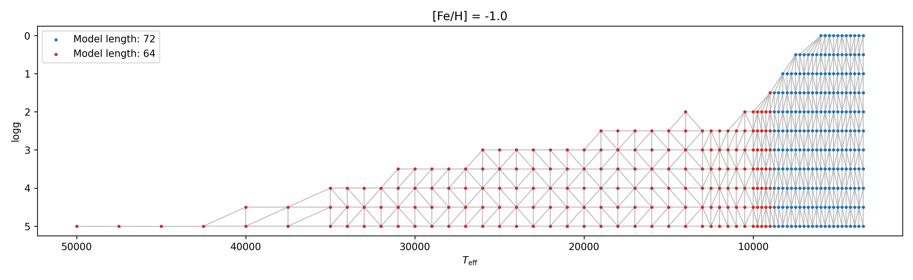

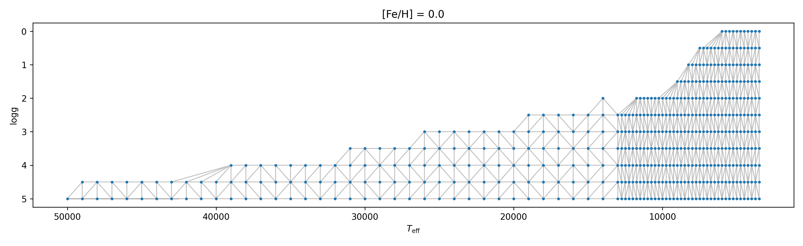
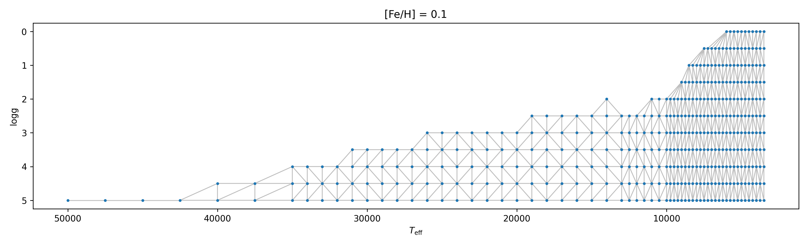
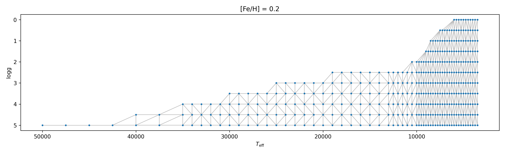

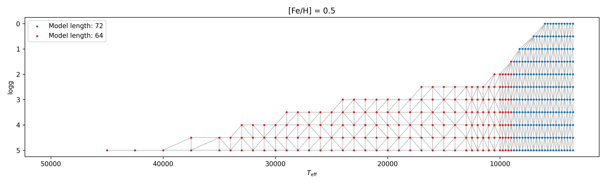
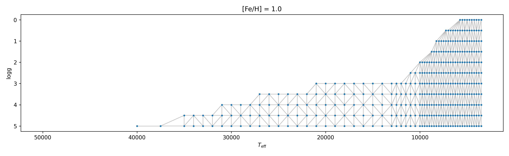

### Caveats

See [this issue](https://github.com/MingjieJian/pymoog/issues/9#issuecomment-653729824).

## Interpolation

Interpolation of the grid points are done with linear Delaunay interpolation used by [ispec](http://adsabs.harvard.edu/abs/2019MNRAS.486.2075B).
The delaunay triangulation of grid points [by scipy](https://docs.scipy.org/doc/scipy/reference/generated/scipy.spatial.Delaunay.html) in Kurucz model is labeled by gray lines in grid point images. 
Note that the actual triangulation may be different from those presented in the above images, since the images only show the Delaunay triangulation in $T_\mathrm{eff}$-$\log{g}$ plane.
Nevertheless, Delaunay triangulation ensure all the models within a triangle or in a gray line can be calculated by interpolation.
If 3/2/1 stellar parameter are not in the grid point position, then 4/3/2 models will be used in interpolation; if all the stellar parameter are in the grid point, then no interpolation will perform.